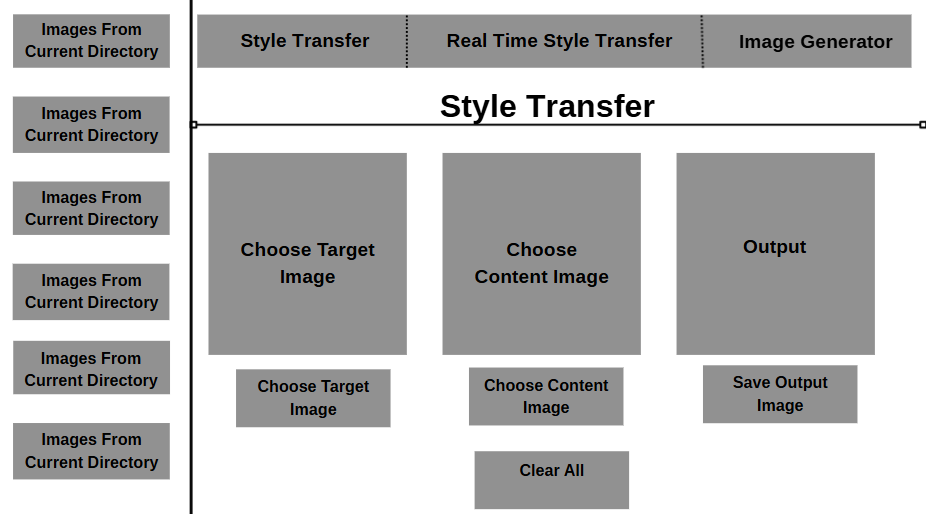
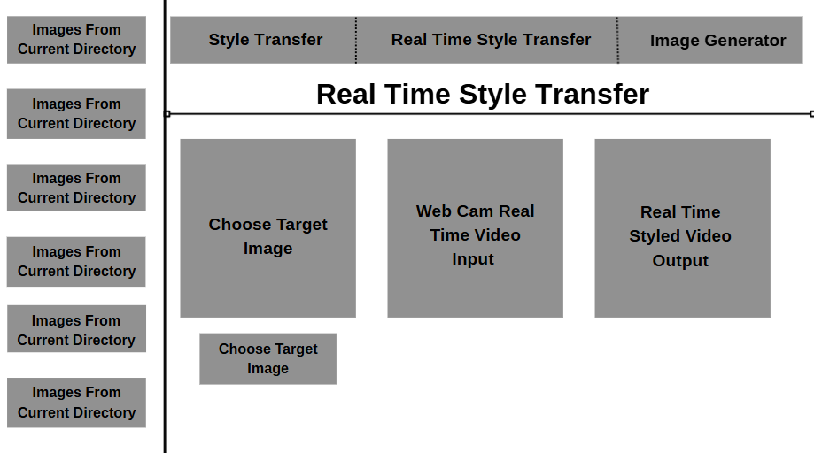
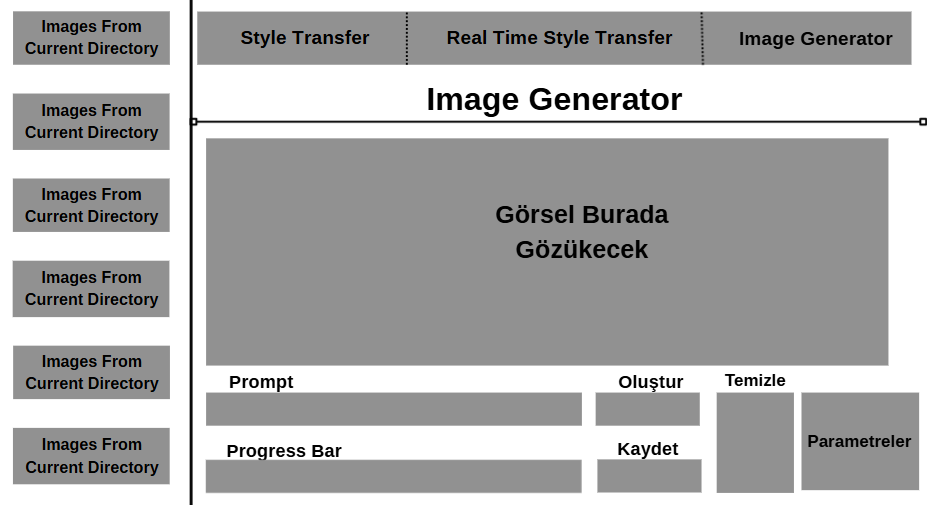

# Image Processing Application - MATLAB

A comprehensive MATLAB-based image processing application featuring neural style transfer, real-time video style transfer, and AI-powered text-to-image generation.



## 🎨 Features

### 1. Style Transfer
Transform your images using pre-trained artistic style models inspired by famous artworks like Van Gogh's Starry Night, The Great Wave, and more.


**Key Features:**
- Choose from multiple pre-trained style models
- Apply artistic styles to any image
- Save stylized outputs
- GPU acceleration support
- Quick access to recently processed images

### 2. Real-Time Style Transfer
Apply artistic styles to live webcam feed in real-time.



**Key Features:**
- Live webcam integration
- Real-time neural network inference
- Start/Stop controls
- Multiple style options
- Optimized for performance

### 3. Image Generator (Text-to-Image)
Generate images from text descriptions using AI diffusion models.



**Key Features:**
- Text-to-image generation using Stable Diffusion
- Adjustable parameters (steps, guidance scale)
- Progress tracking
- Image history sidebar
- Save generated images

## 📋 Requirements

### MATLAB Requirements
- MATLAB R2020b or later
- Deep Learning Toolbox
- Image Processing Toolbox
- Computer Vision Toolbox (for webcam support)
- (Optional) Parallel Computing Toolbox for GPU acceleration

### Python Requirements (for Image Generator)
- Python 3.8 or later
- PyTorch
- Diffusers library
- Transformers library

## 🚀 Installation

### 1. Clone the Repository
```bash
git clone https://github.com/yourusername/image-processing-matlab.git
cd image-processing-matlab
```

### 2. Install Python Dependencies
For the Image Generator feature, install required Python packages:

```bash
pip install torch torchvision
pip install diffusers transformers accelerate
```

### 3. Download Style Transfer Models
The pre-trained style transfer models are included in the `stlyes` folder:
- `starryNight.mat` - Van Gogh's Starry Night style
- `wave.mat` - The Great Wave off Kanagawa style
- `vanGogh.mat` - Van Gogh style
- `scream.mat` - The Scream style

## 💻 Usage

### Running the Main Application

```matlab
% Open MATLAB and navigate to the project directory
app = ImageProcessingApp();
```

This launches the main application with three tabs:

#### **Style Transfer Tab**
1. Click "Choose Target" to select a style image (from the `stlyes` folder)
2. Click "Choose Content" to select the image you want to stylize
3. The styled output appears automatically
4. Click "Save Output" to save the result
5. Use "Clear All" to reset

#### **Real-Time Style Transfer Tab**
1. Click "Choose Target" to select a style
2. Click "Start" to begin webcam capture
3. View real-time styled output
4. Click "Stop" to end the session

#### **Image Generator Tab**
1. Enter a text prompt describing the image you want
2. Adjust parameters:
   - **Steps**: Number of inference steps (10-50)
   - **Guidance**: How closely to follow the prompt (1-20)
3. Click "Oluştur" (Generate) to create the image
4. Monitor progress in the progress bar
5. Click "Kaydet" (Save) to save the generated image

### Running Individual Apps

#### Van Gogh Style Transfer App
```matlab
app = StyleTransferApp();
```

#### Text-to-Image Generator
```matlab
app = TextToImageGUI();
```

## 🏗️ Project Structure

```
image-processing-matlab/
├── ImageProcessingApp.m          # Main application with 3 tabs
├── StyleTransferApp.m            # Standalone style transfer app
├── TextToImageGUI.m              # Standalone text-to-image GUI
├── text2img_helper.py            # Python helper for image generation
├── upsampleLayer.m               # Custom MATLAB upsampling layer
├── stlyes/                       # Pre-trained style models
│   ├── starryNight.jpg
│   ├── starryNight.mat
│   ├── wave.jpeg
│   ├── wave.mat
│   ├── vanGogh.jpeg
│   ├── vanGogh.mat
│   ├── scream.jpeg
│   └── scream.mat
└── README.md
```

## 🔧 Technical Details

### Style Transfer Architecture
- Based on feed-forward neural style transfer networks
- Uses pre-trained models stored as MATLAB `dlnetwork` objects
- Input images are resized to 256×256 for inference
- Outputs are post-processed using tanh activation and scaling
- GPU acceleration automatically enabled when available

### Image Generation Pipeline
1. MATLAB creates and manages Python subprocess
2. Uses HuggingFace's `fine-diffusion` model
3. Supports negative prompts for quality control
4. Progress tracking via callback system
5. CPU-optimized with attention slicing

### Custom Layers
- **upsampleLayer.m**: Custom upsampling layer for neural networks
  - Implements 2× nearest-neighbor upsampling
  - Compatible with MATLAB's dlnetwork framework

## 📸 Example Results

### Style Transfer Examples
The application can transform regular photos into artistic masterpieces:
- Apply Van Gogh's iconic brushstrokes
- Transform images with The Great Wave style
- Create Scream-inspired artwork

### Generated Images
Create unique images from text descriptions:
- Photorealistic scenes
- Artistic compositions
- Creative concepts

## ⚙️ Configuration

### GPU Acceleration
To enable GPU acceleration for faster processing:

```matlab
% Check if GPU is available
canUseGPU()

% The application automatically uses GPU when available
```

### Adjusting Image Generator Parameters
- **Steps (10-50)**: Higher values = better quality, slower generation
- **Guidance (1-20)**: Higher values = closer to prompt, less creative

### Model Selection
To add new style transfer models:
1. Train a style transfer network or obtain a pre-trained model
2. Save as a `.mat` file containing a `dlnetwork` object
3. Place in the `stlyes` folder with a corresponding preview image

## 🐛 Troubleshooting

### Common Issues

**Issue**: "Model file not found" error
- **Solution**: Ensure `.mat` model files are in the `stlyes` folder

**Issue**: Image Generator not working
- **Solution**: Verify Python and required packages are installed
- Check Python path: `system('python --version')`

**Issue**: Webcam not detected
- **Solution**: Install MATLAB Support Package for USB Webcams
- Check webcam availability: `webcamlist`

**Issue**: Out of memory errors
- **Solution**: Close other applications or reduce batch size
- For Image Generator, the model uses CPU by default to avoid memory issues

## 🤝 Contributing

Contributions are welcome! Please feel free to submit a Pull Request.

## 📝 License

This project is provided as-is for educational and research purposes.

## 🙏 Acknowledgments

- Style transfer implementation inspired by Johnson et al.'s fast style transfer
- Image generation powered by HuggingFace's Diffusers library
- Pre-trained models based on artistic works by Van Gogh, Hokusai, and Munch

## 📧 Contact

For questions or feedback, please open an issue on GitHub.

---

**Note**: This application requires significant computational resources, especially for real-time style transfer and image generation. GPU acceleration is recommended for optimal performance.

